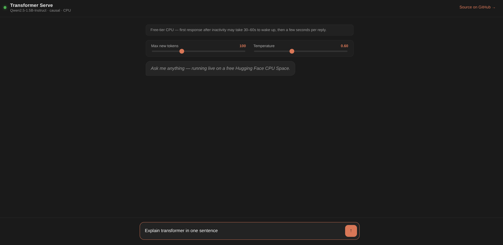

# Transformer Serve

Configurable inference API for Hugging Face text-generation models.  
Swap models via environment variables without changing application code.

<p align="center">
  
</p>

**Live Demo:** [https://ssnym-transformer-serve.hf.space](https://ssnym-transformer-serve.hf.space)

**Docker Hub:** [https://hub.docker.com/r/ssnym/transformer-serve](https://hub.docker.com/r/ssnym/transformer-serve)

## Try it now — no setup required

The API is live. Run these directly:

```bash
curl https://ssnym-transformer-serve.hf.space/health
```

```bash
curl -X POST "https://ssnym-transformer-serve.hf.space/generate" \
  -H "Content-Type: application/json" \
  -d '{"prompt": "Explain what is AI"}'
```

> Note: runs on free CPU hardware and sleeps after inactivity — first request after idle may take 30-60s to wake up.


## Features
- Supports Hugging Face seq2seq or causal text-generation models
- Automatic CPU/GPU detection
- Configurable parameters `max_new_tokens`, `temperature`, `do_sample`
- Input validation
- Dockerized for portable deployment
- Deployable to Hugging Face Spaces

## Run Locally
```bash

git clone https://github.com/ssnym/transformer-serve.git

cd transformer-serve

pip install -r requirements.txt

uvicorn app:app --host 0.0.0.0 --port 8000
```

Test:
```bash
curl -X POST "http://127.0.0.1:8000/generate" \
  -H "Content-Type: application/json" \
  -d '{"prompt": "Explain what is AI"}'
```

## Run with Docker

Built with `Dockerfile.cpu` (CPU-only torch build). Default model is `Qwen/Qwen2.5-1.5B-Instruct` (~3GB) — first run downloads weights from Hugging Face Hub, so expect a few minutes on first start.

Build:

```bash
docker build -f Dockerfile.cpu -t transformer-serve:cpu .
```

Run (default model — Qwen2.5-1.5B-Instruct):

```bash
docker run -p 8000:8000 transformer-serve:cpu
```

Run (custom model, e.g. flan-t5-small):

```bash
docker run -p 8000:8000 -e MODEL_NAME="google/flan-t5-small" -e MODEL_TYPE="seq2seq" transformer-serve:cpu
```

## API — `POST /generate`

Request body:
```json
{
"prompt": "Explain what is AI",
"max_new_tokens": 50,
"temperature": 0.7,
"do_sample": false
}
```

Response:
```json
{"output": "Explain what is AI and how it works.\nArtificial Intelligence (AI) refers to the simulation of human intelligence in machines that are programmed to think, learn, reason, and act like humans. It involves creating algorithms and models that can process large amounts of data, recognize patterns, make decisions, and perform tasks without explicit programming.\n\nThere are several types of AI:\n\n1. Narrow or Weak AI..."}
```

## API — `GET /health`

Returns runtime info about the loaded model and device.

```json
{
  "status": "OK",
  "device": "cpu",
  "model_name": "Qwen/Qwen2.5-1.5B-Instruct",
  "model_type": "qwen2",
  "num_parameters": 1543714304,
  "configured_model_type": "causal"
}
```

## Supported Model Types

- `causal` — decoder-only models (e.g. `Qwen/Qwen2.5-1.5B-Instruct`, `gpt2`, `microsoft/phi-2`)
- `seq2seq` — encoder-decoder models (e.g. `google/flan-t5-small`)

